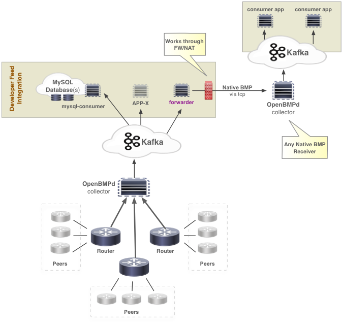

OpenBMP Forwarder
=====================
Currently this forwards the openbmp.bmp_raw stream from Kafka to a remote collector using BMP. This can
be extended support other types of forwarding.

The initial use-case for this consumer is to connect a Kafka cluster to a remote cluster using BMP as
the transport protocol.  You can also use this to connect legacy/other BMP collectors to OpenBMP.

It is possible to spoof the router address so that the receiving collector believes it is receiving messages
from the router, but this only works on a single host.  Spoofing will not work between hosts due to RPF checks.
Spoofing is automatically enabled when the destination collector is localhost.

> Forwarded messages are from the live feed.   This means that if Kafka does not have a long enough log retention
> for the RIB dump, ROUTER_UP, PEER_UP messages, then those messages will not be available till the next time
> the source collector sends them.

### TODO
* Add spoofing support for localhost

### Highlevel Flow

Forwarder enables secure access via a FW and/or NAT.  This includes the ability to translate from IPv4 to IPv6 or IPv6 to IPv6.




Installation
------------
You can either run the code within the **git** directory or you can install it in your python path. 

> If you are going to run it within the **git** directory, see running instructions.  

### Install Dependencies:
    
    sudo apt-get install python-dev python-pip libsnappy-dev
    sudo pip install python-snappy
    sudo pip install kafka-python
    sudo pip install pyyaml


*See [Kafka-python Install Instructions](http://kafka-python.readthedocs.org/en/latest/install.html) for more details.*

### Install:

    git clone https://github.com/OpenBMP/openbmp-forwarder.git
    cd openbmp-file-consumer
    sudo python setup.py install


Running
-------
If you install the python code, then you should be able to run from a terminal

    openbmp-forwarder -c <configuration file>
    
If you are running from within the **git** directory, you can run it as follows:

    PYTHONPATH=./src/site-packages python src/bin/openbmp-forwarder -c src/etc/openbmp-forwarder.yml

    
#### Usage
```
Usage: src/bin/openbmp-forwarder [OPTIONS]

OPTIONS:
  -h, --help                  Print this help menu
  -c, --config                Config filename (default is sys.prefix/etc/openbmp-forwarder.yml)
```

#### Configuration
Configuration is in YAML format via the **openbmp-forwarder.yml** file.  See the file for details.


